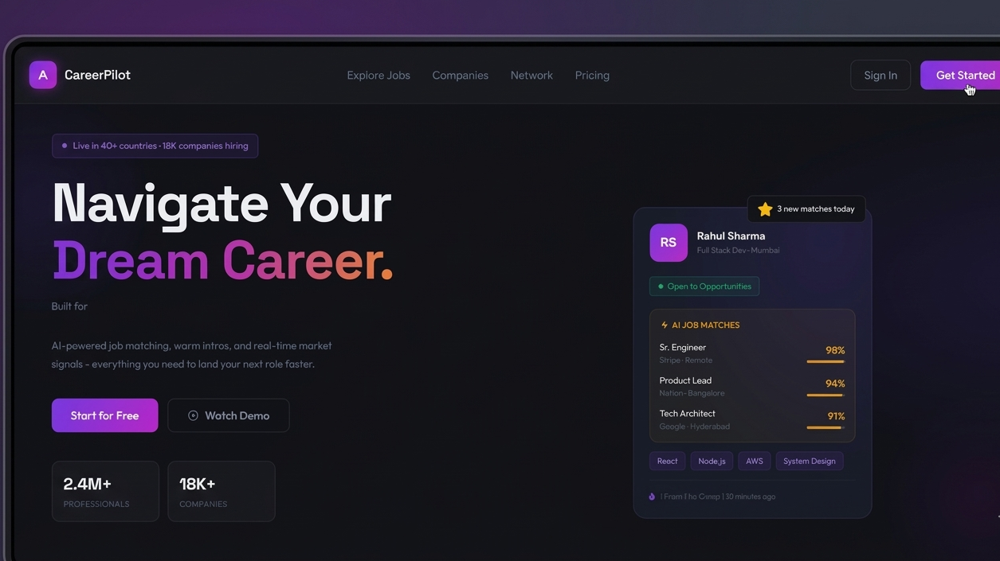

# 💼 CareerPilot - AI-Powered Career Platform

> **CareerPilot** is a modern career platform designed to help users discover opportunities, build professional profiles, and explore jobs using intelligent search.
> From networking to AI-powered job discovery — everything is built to simplify your career journey.

[](https://career-pilot-omega.vercel.app)
[](https://github.com/nikitatale/CareerPilot)
[](https://www.linkedin.com/in/nikita-tale)

---

## 🖼️ Demo Preview



---

## ✨ What Makes This Project Stand Out

| Feature                            | Description                                                   |
| ---------------------------------- | ------------------------------------------------------------- |
| 🤖 **AI Job Search**               | Search jobs using natural language like "MERN developer fresher remote" |
| 👤 **User Profiles**               | Create and manage professional profiles with profile pictures |
| 🤝 **Connect with Professionals**  | Send & manage connection requests                             |
| 📰 **Feed System**                 | View and interact with posts from your network                |
| 🔐 **Authentication System**       | Secure login & signup using bcrypt                            |
| 📄 **Resume Upload & PDF Support** | Upload and manage resumes (PDF generation supported)          |
| 📸 **Image Uploads**               | Profile pictures handled via Multer                           |
| ⚡ **REST API Integration**         | Smooth frontend-backend communication using Axios             |
| 📱 **Responsive UI**               | Clean UI built with Next.js + Tailwind CSS                    |

---

## 🛠️ Tech Stack

```
Frontend   → Next.js 16, React 19, Tailwind CSS, Redux Toolkit
Backend    → Node.js, Express v5
Database   → MongoDB, Mongoose
AI         → Groq (LLaMA 3)
Jobs API   → JSearch (RapidAPI)
Auth       → bcrypt
File Upload → Multer
PDF        → pdfkit, pdf-creator-node
API Client → Axios
Deployment → Vercel (Frontend), Render (Backend)
```

---

## 🚀 Getting Started Locally

### Prerequisites

* Node.js v18+
* MongoDB (local or Atlas)

---

### 1. Clone the Repository

```bash
git clone https://github.com/nikitatale/CareerPilot.git
cd CareerPilot
```

---

### 2. Backend Setup

```bash
cd backend
npm install
```

Create `.env` in `/backend`:

```env
MONGO_URI=your_mongodb_connection_string
JWT_SECRET=your_secret_key
PORT=8080
GROQ_API_KEY=your_groq_api_key
JSEARCH_API_KEY=your_rapidapi_key
```

```bash
npm run dev
```

---

### 3. Frontend Setup

```bash
cd frontend
npm install
npm run dev
```

Visit → **http://localhost:3000**

---

## 📁 Project Structure

```
CareerPilot/
├── frontend/
│   ├── app/
│   ├── components/
│   ├── redux/
│   └── public/
│
├── backend/
│   ├── routes/
│   ├── models/
│   ├── controllers/
│   └── server.js
│
├── .gitignore
└── README.md
```

---

## 🌐 Live Deployment

| Service  | Link                                  |
| -------- | ------------------------------------- |
| Demo | https://career-pilot-omega.vercel.app       |


---

## 💡 Key Learnings & Challenges

* Built **full-stack MERN application** with AI integration
* Implemented natural language → structured query parsing
* Integrated third-party APIs (Jobs + AI)
* Implemented **file uploads using Multer**
* Handled **secure authentication & password hashing**
* Managed **API integration between Next.js frontend and Express backend**
* Deployed **frontend & backend separately (Vercel + Render)**

---

## 👩‍💻 About the Developer

**Nikita Tale** - Full-Stack Developer (MERN Stack)
📧 Open to work! Let's connect →

[](https://www.linkedin.com/in/nikita-tale)
[](https://github.com/nikitatale)

---

> ⭐ If you found this project interesting, please star it - it really helps!
